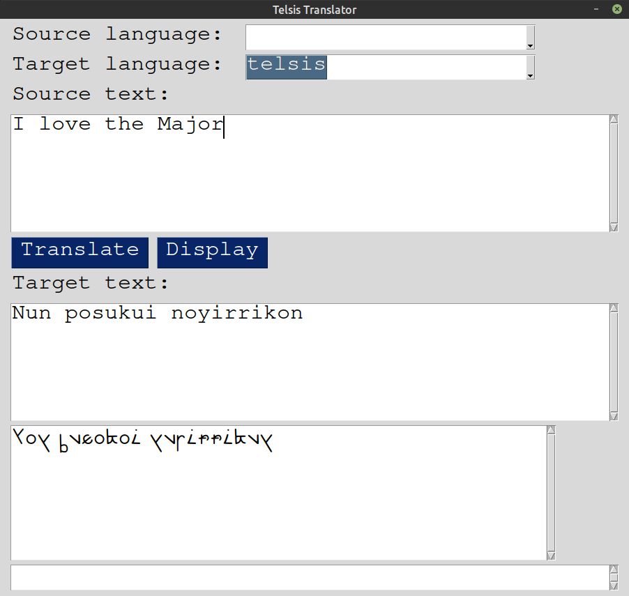

# Telsis language translator
This Python3 script translates to and from the Telsis language, the language used in the world setting of Violet Evergarden. The language is created by translating the source text into Tamil, converting the Tamil script into unaccented English alphabet characters, using a substitution cipher to swap the characters, and finally representing the results in the Telsis alphabet. The [References](#references) section contains more information about decoding the language and the original script from which this translator is built on. This script can be used from the [commandline](#basic-usage), in [interactive console mode](#interactive-console-mode), or as a [Python library](#use-as-library). A GUI is also available but it requires PySimpleGUI. A future GUI will use [Kivy](https://kivy.org/). Detailed explanation of how to script works can be found [here](explanation.md).

Note: Not for commercial use as this script uses the [google_trans_new](https://github.com/lushan88a/google_trans_new) library which does not allow usage for commercial purposes.

## Requirements
```
google_trans_new
unidecode
requests
Pillow
```
Install requirements (less PySimpleGUI or Kivy) with:
```
pip3 install -r requirements.txt
```

To install PySimpleGUI, which is needed for the GUI:
```
pip3 install pysimplegui
```
The font file [TelsisTyped.otf](TelsisTyped.otf) is required for the GUI and needs to be installed in the system font path. This can be `~/.fonts` for Linux systems. For Windows, it will need to be installed.

A future version will need [Kivy](https://kivy.org/) to run the GUI. See the instructions [here](https://kivy.org/doc/stable/gettingstarted/installation.html) on how to install Kivy. 


## Basic usage
```
usage: telsistrans [-h] [-g | -i | -t TEXT] [-sl SRCLANG] [-tl TGTLANG] [-d] [-f FONT]

optional arguments:
  -h, --help            show this help message and exit
  -g, --gui             graphical mode
  -i, --interactive     interactive console mode
  -t TEXT, --text TEXT  source text
  -sl SRCLANG, --srclang SRCLANG
                        source language
  -tl TGTLANG, --tgtlang TGTLANG
                        target language
  -d, --display         display results in Telsis font
  -f FONT, --font FONT  font file
```
Either the source or target language must be specified in order for the translator to work. They must also not be the same.

If Telsis is specified as the source language, the translator will attempt to translate the source text into the given target language, which defaults to English if not specified. If a source language other than Telsis is specified, the translator will attempt to translate the source text into Telsis.

If Telsis is specified as the target language, the translator will attempt to translate the source text into Telsis, guessing the source language if it is not specified. If a target language other than Telsis is specified, the translator will assume the source text is in the Telsis language and attempt to translate the source text into the given target language.

The "display" option (`-d` or `--display`) can be used to show the results in the Telsis alphabet if the target language is Telsis. A font file must be specified for this to work. See the section on [Fonts](#fonts) for more information.

Names that are not to be translated can be enclosed in double backslashes.

The "gui" option will launch a GUI if PySimpleGUI (or in the future, [Kivy](https://kivy.org/)) is installed.



## Interactive console mode
The interactive console mode allows the user to enter the source language, source text, and target language for translation. If a font file is specified, the translated Telsis language result (if the target language is Telsis) can also be displayed in the Telsis alphabet.

To enter interactive console mode:
```
telsistrans -i
```
To enter interactive console mode and display the results in the Telsis alphabet:
```
telsistrans -i -d -f fontfile.ttf
```
where `fontfile.ttf` is the Truetype or OpenType font to use. For more information, see the section on [Fonts](#fonts).

To exit the interactive console mode, enter `quit` for the source language.


## Examples
Translate from Telsis language (target language defaults to English):
```
$ ./telsistrans -t nunki -sl telsis
Thanks
```
Translate to Telsis language:
```
$ ./telsistrans -t thanks -tl telsis
Nunki
```
Translate to Japanese (source language assumed to be Telsis):
```
$ ./telsistrans -t nunki -tl ja
ありがとう
```
Translate from simplified Chinese (target language assumed to be Telsis):
```
$ ./telsistrans -t 谢谢 -sl zh-cn
Nunki
```
For longer text, enclose the source text in quotes:
```
$ ./telsistrans -t "I love you" -tl telsis
Nun annui noyirrikon
$ ./telsistrans -t "nunki posuk" -tl en
Thank you Major
```
Displaying in Telsis alphabet:
```
$ ./telsistrans -t "I love you" -sl en -d -f Automemoryfont.otf 
Nun annui noyirrikon
```


Names can be enclosed in backslashes so that they appear correctly in translated text. A backslash is also used as an escape character. If the use of backslash can result in such characters, leave a space after the backslash. See the first and third examples below.
```
$ ./telsistrans -t "I love Major \Gilbert\ " -sl en
Nun posuk Gilbert ui gikapmarikon
$ ./telsistrans -t "Posuk \Gilbert\ nunki." -sl telsis
Thank you Major Gilbert.
$ ./telsistrans -t "Thank you Major \Gilbert\ " -sl en
Posuk Gilbert nunki
$ ./telsistrans -t "Nun posuk \Gilbert\ ui gikapmarikon." -sl telsis
I like Major Gilbert.
$ ./telsistrans -t "Thank you \Gilbert\ , \Hodgins\ , and \Violet\." -sl en
Gilbert, Hodgins pukkap Violet nunki.
```

Note: Punctuation is sometimes not handled properly, so it is best to avoid using punctuation marks in the source text. For example:
```
$ ./telsistrans -t "\Gilbert\ , \Hodgins\ pukkap \Violet\ nunki." -sl telsis
Gilbert
$ ./telsistrans -t "\Gilbert\ \Hodgins\ pukkap \Violet\ nunki." -sl telsis
Thanks to Gilbert Hodgkins and Violet.
```
The issue seems to be with the handling of comma. A workaround is to use some other punctuation mark, like a semi-colon.
```
$ ./telsistrans -t "Nunki \Gilbert\ ; \Hodgins\ pukkap \Violet\ " -sl telsis
Thanks Gilbert; Hodgkins and Violet
```

## Use as library
The translator has been implemented as a Python class, which allows the script to be used as a library. The basic method is to create an instance of the `telsis_translator` class, and call either the `lang2telsis` method to translate to the Telsis language, or `telsis2lang` to translate from the Telsis language. The target text is found in `results['tgt_text']` of the class.

```
from telsistrans import telsis_translator
translator = telsis_translator()
srctext = "I love you"
srclang = 'en'
translator.lang2telsis(srctext, srclang)
print(translator.results['tgt_text'])  # Print out results of translation
srctext = "Nunki posuk"
tgtlang = 'ja'
translator.telsis2lang(srctext, tgtlang)
print(translator.results['tgt_text'])  # Print out results of translation
```
Output of the above example:
```
Nun annui noyirrikon
ありがとう少佐
```


## Fonts
A font file for the Telsis alphabet is required to display the Telsis language results properly. A simple font file [TelsisTyped.otf](TelsisTyped.otf) has been included in this repository. Alternatives include the [Violet_evergardenV14-Regular.ttf](https://goo.gl/PUiwDe) file from this [Reddit post](https://www.reddit.com/r/anime/comments/7t789w/violet_evergarden_how_to_be_an_optimal_dollfont/) or the [Automemoryfont.otf](https://drive.google.com/file/d/1a2FY8_Yyyk3ULGhpq7sPQ2N5KurLKyIk/view?usp=sharing) from this [Reddit post](https://www.reddit.com/r/VioletEvergarden/comments/fzkvc3/i_made_the_font_update/). The font file is specified by either the `-f` or `--font` option followed by the filename of the font file.

The font can also be used directly with the `telsis_display` command. For example:

```
$ ./telsis_display "Nunki posuk"
$ ./telsis_display "Nun annui noyirrikon" -f TelsisTyped.otf
```

For the desktop GUI, the font file needs to be in your system. In Linux systems, you can place the file in `~/.fonts` folder. In Windows, you will need to install the font. Currently, the desktop GUI uses [TelsisTyped.otf](TelsisTyped.otf) included in this repository. 

## Versions
Current version: v0.2
- v0.1: Initial version with basic operations from command line, interactive console mode, and use as library. Names can be handled by enclosing in double backslashes.
- v0.2: Added simple GUI using PySimpleGUI.

TODO:
- More robust testing using available text in Telsis language
- Find a way to handle punctuation correctly
- Create a Kivy GUI with a nice looking theme
- Find a Google Translate Python library that allows commercial use (maybe the [pygoogletranslation](https://github.com/Saravananslb/py-googletranslation) library or the [Googletrans](https://github.com/ssut/py-googletrans) library)
- Ambitious goal: train a deep learning neural network to recognize Telsis language alphabets and convert them into English alphabets, then run translation on the result


## References
- Original [Python script](https://repl.it/@ValkrenDarklock/NunkishTrans) by Valkren, which translates Telsis into English
- [Reddit post](https://www.reddit.com/r/anime/comments/88bbob/violet_evergarden_alphabet_and_language_part_2/) on decoding the Telsis language


## License
MIT License; see [LICENSE](LICENSE) file for more information.


Copyright (c) 2021 Vivian Ng